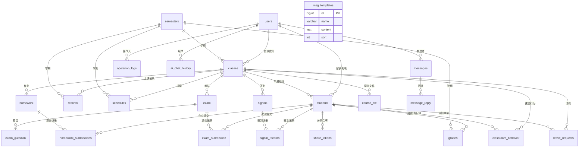

# 上课通-基于数据驱动的课外辅导教学辅助管理系统
# 数据库设计文档

---

## 1. 数据库概述

### 1.1 数据库基本信息

| 项目 | 说明 |
|------|------|
| 数据库名称 | skt_db |
| 数据库类型 | MySQL 8.0 |
| 字符集 | utf8mb4 |
| 排序规则 | utf8mb4_unicode_ci |
| 存储引擎 | InnoDB |
| 表数量 | 23张核心业务表 |
| 设计模式 | 第三范式（3NF），部分场景适度反范式优化查询性能 |

### 1.2 设计原则

1. **权责分离**：用户、学生、班级、教师实体独立，通过外键关联
2. **数据隔离**：家长/学生角色仅能访问关联数据，通过应用层权限控制
3. **软删除**：学生信息采用is_deleted软删除，保留历史数据
4. **审计追踪**：operation_logs表记录关键操作，支持追溯
5. **扩展性**：JSON字段存储灵活配置（如考试配置、题目内容），减少表结构变更

### 1.3 角色与数据权限

| 角色 | 可访问数据范围 |
|------|--------------|
| admin（超级管理员） | 全部数据，含用户管理、操作日志、财务台账 |
| teacher（教师） | 所带班级的学生、成绩、作业、考试、消息、上课记录 |
| parent（家长） | 关联学生的成绩、作业、出勤、消息、请假 |
| student（学生） | 本人的成绩、作业、出勤、积分、错题、考试 |

---

## 2. 实体关系图（E-R图）

### 2.1 核心实体关系

### 2.2 实体关系说明

| 关系类型 | 实体A | 实体B | 关系说明 |
|---------|-------|-------|---------|
| 1:N | users | classes | 一个教师可带多个班级 |
| 1:N | users | students | 一个家长可关联多个学生 |
| 1:N | classes | students | 一个班级有多个学生 |
| 1:N | students | grades | 一个学生有多条成绩记录 |
| 1:N | homework | homework_submissions | 一次作业有多个学生提交 |
| 1:N | exam | exam_question | 一场考试有多道题目 |
| 1:N | exam | exam_submission | 一场考试有多个学生提交 |
| 1:N | signins | signin_records | 一次签到有多个学生记录 |
| 1:N | messages | message_reply | 一条消息有多条回复 |
| 1:N | users | operation_logs | 一个用户有多条操作日志 |

---

## 3. 数据表结构详细说明

### 3.1 用户与权限模块

#### 3.1.1 users（用户账号表）

| 字段名 | 数据类型 | 约束 | 默认值 | 说明 |
|--------|---------|------|--------|------|
| id | BIGINT | PRIMARY KEY, AUTO_INCREMENT | - | 用户ID |
| username | VARCHAR(50) | NOT NULL, UNIQUE | - | 登录账号 |
| password_hash | VARCHAR(200) | NOT NULL | - | BCrypt加密密码哈希 |
| role | VARCHAR(20) | NOT NULL | - | 角色：admin/teacher/parent/student |
| display_name | VARCHAR(50) | - | '' | 显示名称（真实姓名） |
| phone | VARCHAR(20) | - | NULL | 联系电话 |
| created_at | DATETIME | - | CURRENT_TIMESTAMP | 创建时间 |

**索引**：username（唯一索引）

---

### 3.2 基础数据模块

#### 3.2.1 semesters（学期表）

| 字段名 | 数据类型 | 约束 | 默认值 | 说明 |
|--------|---------|------|--------|------|
| id | BIGINT | PRIMARY KEY, AUTO_INCREMENT | - | 学期ID |
| name | VARCHAR(100) | NOT NULL | - | 学期名称（如2025年春季） |
| start_date | VARCHAR(20) | NOT NULL | - | 开始日期 |
| end_date | VARCHAR(20) | NOT NULL | - | 结束日期 |
| is_active | TINYINT | - | 1 | 是否当前学期（0/1） |
| created_at | DATETIME | - | CURRENT_TIMESTAMP | 创建时间 |

#### 3.2.2 classes（班级表）

| 字段名 | 数据类型 | 约束 | 默认值 | 说明 |
|--------|---------|------|--------|------|
| id | BIGINT | PRIMARY KEY, AUTO_INCREMENT | - | 班级ID |
| name | VARCHAR(100) | NOT NULL | - | 班级名称 |
| course | VARCHAR(100) | NOT NULL | - | 课程名称 |
| semester_id | BIGINT | - | NULL | 所属学期ID |
| teacher_id | BIGINT | - | NULL | 授课教师ID（关联users.id） |
| created_at | DATETIME | - | CURRENT_TIMESTAMP | 创建时间 |

#### 3.2.3 students（学生信息表）

| 字段名 | 数据类型 | 约束 | 默认值 | 说明 |
|--------|---------|------|--------|------|
| id | BIGINT | PRIMARY KEY, AUTO_INCREMENT | - | 学生ID |
| name | VARCHAR(50) | NOT NULL | - | 学生姓名 |
| class_id | BIGINT | - | NULL | 所属班级ID |
| parent_id | BIGINT | - | NULL | 家长用户ID（关联users.id） |
| user_id | BIGINT | - | NULL | 绑定的学生账号ID（关联users.id） |
| phone | VARCHAR(20) | - | NULL | 学生电话 |
| parent_phone | VARCHAR(20) | - | NULL | 家长电话 |
| parent_name | VARCHAR(50) | - | NULL | 家长姓名 |
| parent_relation | VARCHAR(20) | - | NULL | 家长关系（父亲/母亲等） |
| enrollment_date | VARCHAR(20) | - | NULL | 入学日期 |
| status | VARCHAR(20) | - | 'active' | 状态（active/inactive） |
| is_deleted | TINYINT | - | 0 | 软删除标记（0/1） |
| tags | TEXT | - | NULL | 标签（JSON数组） |
| created_at | DATETIME | - | CURRENT_TIMESTAMP | 创建时间 |

**索引**：idx_user_id（user_id）

---

### 3.3 教学管理模块

#### 3.3.1 records（上课记录表）

| 字段名 | 数据类型 | 约束 | 默认值 | 说明 |
|--------|---------|------|--------|------|
| id | BIGINT | PRIMARY KEY, AUTO_INCREMENT | - | 记录ID |
| date | VARCHAR(20) | NOT NULL | - | 上课日期 |
| class_id | BIGINT | - | NULL | 班级ID |
| class_name | VARCHAR(100) | - | NULL | 班级名称（冗余） |
| course | VARCHAR(100) | - | NULL | 课程名称 |
| sessions | INT | - | 1 | 课时数 |
| type | VARCHAR(50) | - | NULL | 课程类型 |
| semester_id | BIGINT | - | NULL | 学期ID |
| remark | TEXT | - | NULL | 备注 |
| absent_json | TEXT | - | NULL | 缺勤学生JSON |
| trial_students | TEXT | - | NULL | 试听学生JSON |
| created_at | DATETIME | - | CURRENT_TIMESTAMP | 创建时间 |

#### 3.3.2 schedules（排课表）

| 字段名 | 数据类型 | 约束 | 默认值 | 说明 |
|--------|---------|------|--------|------|
| id | BIGINT | PRIMARY KEY, AUTO_INCREMENT | - | 排课ID |
| weekday | INT | NOT NULL | - | 星期（1-7） |
| start_time | VARCHAR(10) | NOT NULL | - | 开始时间（HH:mm） |
| end_time | VARCHAR(10) | NOT NULL | - | 结束时间（HH:mm） |
| class_id | BIGINT | - | NULL | 班级ID |
| class_name | VARCHAR(100) | - | NULL | 班级名称 |
| course | VARCHAR(100) | - | NULL | 课程名称 |
| sessions | INT | - | 1 | 课时数 |
| semester_id | BIGINT | - | NULL | 学期ID |
| teacher_id | BIGINT | - | NULL | 教师ID |

#### 3.3.3 grades（成绩表）

| 字段名 | 数据类型 | 约束 | 默认值 | 说明 |
|--------|---------|------|--------|------|
| id | BIGINT | PRIMARY KEY, AUTO_INCREMENT | - | 成绩ID |
| student_id | BIGINT | - | NULL | 学生ID |
| student_name | VARCHAR(50) | - | NULL | 学生姓名（冗余） |
| class_id | BIGINT | - | NULL | 班级ID |
| class_name | VARCHAR(100) | - | NULL | 班级名称（冗余） |
| exam_name | VARCHAR(100) | NOT NULL | - | 考试名称 |
| exam_type | VARCHAR(30) | - | 'unit_test' | 考试类型（unit_test/midterm/final/homework） |
| score | DOUBLE | NOT NULL | - | 得分 |
| total_score | DOUBLE | - | 100 | 满分 |
| rank | INT | - | NULL | 班级排名 |
| semester_id | BIGINT | - | NULL | 学期ID |
| teacher_id | BIGINT | - | NULL | 录入教师ID |
| remark | TEXT | - | NULL | 备注 |
| created_at | DATETIME | - | CURRENT_TIMESTAMP | 创建时间 |

---

### 3.4 作业管理模块

#### 3.4.1 homework（作业表）

| 字段名 | 数据类型 | 约束 | 默认值 | 说明 |
|--------|---------|------|--------|------|
| id | BIGINT | PRIMARY KEY, AUTO_INCREMENT | - | 作业ID |
| class_id | BIGINT | - | NULL | 班级ID |
| title | VARCHAR(200) | NOT NULL | - | 作业标题 |
| content | TEXT | - | NULL | 作业内容 |
| deadline | VARCHAR(20) | - | NULL | 截止时间 |
| created_by | BIGINT | - | NULL | 发布教师ID |
| created_at | DATETIME | - | CURRENT_TIMESTAMP | 创建时间 |

#### 3.4.2 homework_submissions（作业提交表）

| 字段名 | 数据类型 | 约束 | 默认值 | 说明 |
|--------|---------|------|--------|------|
| id | BIGINT | PRIMARY KEY, AUTO_INCREMENT | - | 提交ID |
| homework_id | BIGINT | - | NULL | 作业ID |
| student_id | BIGINT | - | NULL | 学生ID |
| student_name | VARCHAR(50) | - | NULL | 学生姓名 |
| content | TEXT | - | NULL | 提交内容 |
| score | DOUBLE | - | NULL | 批改分数 |
| comment | TEXT | - | NULL | 教师评语 |
| submitted_at | DATETIME | - | NULL | 提交时间 |

---

### 3.5 考试模块

#### 3.5.1 exam（考试表）

| 字段名 | 数据类型 | 约束 | 默认值 | 说明 |
|--------|---------|------|--------|------|
| id | BIGINT | PRIMARY KEY, AUTO_INCREMENT | - | 考试ID |
| exam_code | VARCHAR(64) | NOT NULL, UNIQUE | - | 考试编码 |
| class_id | BIGINT | NOT NULL | - | 班级ID |
| teacher_id | BIGINT | NOT NULL | - | 教师ID |
| title | VARCHAR(200) | - | '课堂测试' | 考试标题 |
| duration | INT | - | 30 | 考试时长（分钟） |
| password | VARCHAR(50) | - | '' | 考试密码 |
| status | VARCHAR(20) | - | 'pending' | 状态（pending/running/ended） |
| start_time | DATETIME | - | NULL | 开始时间 |
| end_time | DATETIME | - | NULL | 结束时间 |
| config_json | TEXT | - | NULL | 考试配置JSON |
| created_at | DATETIME | - | CURRENT_TIMESTAMP | 创建时间 |

#### 3.5.2 exam_question（考试题目表）

| 字段名 | 数据类型 | 约束 | 默认值 | 说明 |
|--------|---------|------|--------|------|
| id | BIGINT | PRIMARY KEY, AUTO_INCREMENT | - | 题目ID |
| exam_id | BIGINT | NOT NULL | - | 考试ID |
| question_json | TEXT | NOT NULL | - | 题目内容JSON（题干/选项/答案/分值/类型） |
| sort_order | INT | - | 0 | 排序序号 |

#### 3.5.3 exam_submission（考试提交表）

| 字段名 | 数据类型 | 约束 | 默认值 | 说明 |
|--------|---------|------|--------|------|
| id | BIGINT | PRIMARY KEY, AUTO_INCREMENT | - | 提交ID |
| exam_id | BIGINT | NOT NULL | - | 考试ID |
| student_id | BIGINT | - | NULL | 学生ID |
| student_name | VARCHAR(50) | - | NULL | 学生姓名 |
| answers_json | TEXT | - | NULL | 答案JSON |
| score | DOUBLE | - | NULL | 得分 |
| submitted_at | DATETIME | - | CURRENT_TIMESTAMP | 提交时间 |

---

### 3.6 家校互通模块

#### 3.6.1 messages（消息表）

| 字段名 | 数据类型 | 约束 | 默认值 | 说明 |
|--------|---------|------|--------|------|
| id | BIGINT | PRIMARY KEY, AUTO_INCREMENT | - | 消息ID |
| sender_id | BIGINT | - | NULL | 发送者ID |
| sender_name | VARCHAR(50) | - | NULL | 发送者姓名 |
| sender_role | VARCHAR(20) | - | NULL | 发送者角色 |
| receiver_id | BIGINT | - | NULL | 接收者ID |
| student_id | BIGINT | - | NULL | 关联学生ID |
| student_name | VARCHAR(50) | - | NULL | 学生姓名 |
| class_id | BIGINT | - | NULL | 班级ID |
| class_name | VARCHAR(100) | - | NULL | 班级名称 |
| title | VARCHAR(200) | - | NULL | 消息标题 |
| content | TEXT | NOT NULL | - | 消息内容 |
| msg_type | VARCHAR(30) | - | 'notice' | 消息类型（notice/consult/private） |
| status | VARCHAR(20) | - | 'unread' | 状态（unread/read） |
| read_at | DATETIME | - | NULL | 已读时间 |
| created_at | DATETIME | - | CURRENT_TIMESTAMP | 创建时间 |

#### 3.6.2 message_reply（消息回复表）

| 字段名 | 数据类型 | 约束 | 默认值 | 说明 |
|--------|---------|------|--------|------|
| id | BIGINT | PRIMARY KEY, AUTO_INCREMENT | - | 回复ID |
| message_id | BIGINT | NOT NULL | - | 原消息ID |
| sender_id | BIGINT | NOT NULL | - | 发送者ID |
| sender_name | VARCHAR(100) | - | NULL | 发送者姓名 |
| sender_role | VARCHAR(20) | - | NULL | 发送者角色 |
| content | TEXT | NOT NULL | - | 回复内容 |
| created_at | DATETIME | - | CURRENT_TIMESTAMP | 创建时间 |

#### 3.6.3 msg_templates（消息模板表）

| 字段名 | 数据类型 | 约束 | 默认值 | 说明 |
|--------|---------|------|--------|------|
| id | BIGINT | PRIMARY KEY, AUTO_INCREMENT | - | 模板ID |
| name | VARCHAR(50) | NOT NULL | - | 模板名称 |
| content | TEXT | NOT NULL | - | 模板内容 |
| sort | INT | - | 1 | 排序序号 |

---

### 3.7 上课模式模块

#### 3.7.1 course_file（课堂文件互传表）

| 字段名 | 数据类型 | 约束 | 默认值 | 说明 |
|--------|---------|------|--------|------|
| id | BIGINT | PRIMARY KEY, AUTO_INCREMENT | - | 文件ID |
| class_id | BIGINT | NOT NULL | - | 上课班级ID |
| teacher_id | BIGINT | NOT NULL | - | 授课教师ID |
| student_id | BIGINT | - | NULL | 学生ID（学生提交作业时有值） |
| file_name | VARCHAR(255) | NOT NULL | - | 原始文件名 |
| save_path | VARCHAR(500) | NOT NULL | - | 服务器存储相对路径 |
| file_suffix | VARCHAR(50) | NOT NULL | - | 文件后缀 |
| file_size | BIGINT | NOT NULL | - | 文件字节大小 |
| upload_time | DATETIME | NOT NULL | CURRENT_TIMESTAMP | 上传时间 |
| is_teacher_upload | TINYINT | NOT NULL | 1 | 1=教师下发课件 0=学生提交作业 |

#### 3.7.2 signins（签到任务表）

| 字段名 | 数据类型 | 约束 | 默认值 | 说明 |
|--------|---------|------|--------|------|
| id | BIGINT | PRIMARY KEY, AUTO_INCREMENT | - | 签到ID |
| class_id | BIGINT | NOT NULL | - | 班级ID |
| class_name | VARCHAR(100) | - | NULL | 班级名称 |
| teacher_id | BIGINT | NOT NULL | - | 教师ID |
| sign_type | VARCHAR(20) | - | 'password' | 签到类型（password/qrcode） |
| password | VARCHAR(20) | - | NULL | 签到密码 |
| status | VARCHAR(20) | - | 'running' | 状态（running/ended） |
| deadline | DATETIME | - | NULL | 截止时间 |
| created_at | DATETIME | - | CURRENT_TIMESTAMP | 创建时间 |

#### 3.7.3 signin_records（签到记录表）

| 字段名 | 数据类型 | 约束 | 默认值 | 说明 |
|--------|---------|------|--------|------|
| id | BIGINT | PRIMARY KEY, AUTO_INCREMENT | - | 记录ID |
| signin_id | BIGINT | NOT NULL | - | 签到任务ID |
| student_id | BIGINT | NOT NULL | - | 学生ID |
| student_name | VARCHAR(50) | - | NULL | 学生姓名 |
| parent_id | BIGINT | - | NULL | 家长ID |
| status | VARCHAR(20) | - | 'absent' | 状态（present/absent/late） |
| signed_at | DATETIME | - | NULL | 签到时间 |
| created_at | DATETIME | - | CURRENT_TIMESTAMP | 创建时间 |

#### 3.7.4 classroom_behavior（课堂行为记录表）

| 字段名 | 数据类型 | 约束 | 默认值 | 说明 |
|--------|---------|------|--------|------|
| id | BIGINT | PRIMARY KEY, AUTO_INCREMENT | - | 行为ID |
| class_id | BIGINT | NOT NULL | - | 班级ID |
| class_name | VARCHAR(100) | - | NULL | 班级名称 |
| teacher_id | BIGINT | NOT NULL | - | 教师ID |
| student_id | BIGINT | NOT NULL | - | 学生ID |
| student_name | VARCHAR(50) | - | NULL | 学生姓名 |
| session_id | BIGINT | - | NULL | 课堂会话ID |
| behavior_type | VARCHAR(30) | NOT NULL | - | 行为类型（signin/raise_hand/answer/quiz/file_upload） |
| behavior_detail | TEXT | - | NULL | 行为详情 |
| score_change | INT | - | 0 | 积分变化 |
| created_at | DATETIME | - | CURRENT_TIMESTAMP | 创建时间 |

**索引**：idx_class_id、idx_student_id、idx_behavior_type

---

### 3.8 请假审批模块

#### 3.8.1 leave_requests（请假申请表）

| 字段名 | 数据类型 | 约束 | 默认值 | 说明 |
|--------|---------|------|--------|------|
| id | BIGINT | PRIMARY KEY, AUTO_INCREMENT | - | 请假ID |
| student_id | BIGINT | NOT NULL | - | 学生ID |
| student_name | VARCHAR(50) | - | NULL | 学生姓名 |
| class_id | BIGINT | - | NULL | 班级ID |
| parent_id | BIGINT | - | NULL | 家长ID |
| parent_name | VARCHAR(50) | - | NULL | 家长姓名 |
| leave_date | DATE | NOT NULL | - | 请假日期 |
| leave_type | VARCHAR(20) | - | 'sick' | 类型（sick病假/personal事假/other） |
| reason | TEXT | - | NULL | 请假原因 |
| status | VARCHAR(20) | - | 'pending' | 状态（pending/approved/rejected） |
| teacher_id | BIGINT | - | NULL | 审批教师ID |
| teacher_remark | TEXT | - | NULL | 教师备注 |
| approved_at | DATETIME | - | NULL | 审批时间 |
| created_at | DATETIME | - | CURRENT_TIMESTAMP | 创建时间 |
| updated_at | DATETIME | - | CURRENT_TIMESTAMP ON UPDATE | 更新时间 |

**索引**：idx_student_id、idx_class_id、idx_status

---

### 3.9 系统安全模块

#### 3.9.1 operation_logs（操作审计日志表）

| 字段名 | 数据类型 | 约束 | 默认值 | 说明 |
|--------|---------|------|--------|------|
| id | BIGINT | PRIMARY KEY, AUTO_INCREMENT | - | 日志ID |
| user_id | BIGINT | - | NULL | 操作人ID |
| username | VARCHAR(100) | - | NULL | 操作人账号 |
| role | VARCHAR(20) | - | NULL | 操作人角色 |
| operation | VARCHAR(100) | NOT NULL | - | 操作类型 |
| detail | TEXT | - | NULL | 操作详情 |
| ip | VARCHAR(50) | - | NULL | 操作IP |
| created_at | DATETIME | - | CURRENT_TIMESTAMP | 操作时间 |

**索引**：idx_user_id、idx_operation、idx_created_at

#### 3.9.2 share_tokens（分享令牌表）

| 字段名 | 数据类型 | 约束 | 默认值 | 说明 |
|--------|---------|------|--------|------|
| id | BIGINT | PRIMARY KEY, AUTO_INCREMENT | - | 令牌ID |
| token | VARCHAR(64) | NOT NULL, UNIQUE | - | 分享令牌 |
| student_id | BIGINT | NOT NULL | - | 学生ID |
| is_permanent | TINYINT | - | 0 | 是否永久有效 |
| expires_at | DATETIME | - | NULL | 过期时间 |
| created_by | BIGINT | - | NULL | 创建人ID |
| created_at | DATETIME | - | CURRENT_TIMESTAMP | 创建时间 |

---

### 3.10 AI与扩展模块

#### 3.10.1 ai_chat_history（AI对话记录表）

| 字段名 | 数据类型 | 约束 | 默认值 | 说明 |
|--------|---------|------|--------|------|
| id | BIGINT | PRIMARY KEY, AUTO_INCREMENT | - | 记录ID |
| user_id | BIGINT | NOT NULL | - | 用户ID |
| session_id | VARCHAR(64) | - | NULL | 会话ID |
| role | VARCHAR(20) | NOT NULL | - | 角色（user/assistant） |
| content | TEXT | NOT NULL | - | 对话内容 |
| created_at | DATETIME | - | CURRENT_TIMESTAMP | 创建时间 |

---

## 4. 索引设计汇总

| 表名 | 索引名 | 索引字段 | 索引类型 | 用途 |
|------|--------|---------|---------|------|
| users | - | username | UNIQUE | 登录账号唯一校验 |
| students | idx_user_id | user_id | NORMAL | 学生账号绑定查询 |
| operation_logs | idx_user_id | user_id | NORMAL | 按用户查询操作日志 |
| operation_logs | idx_operation | operation | NORMAL | 按操作类型筛选 |
| operation_logs | idx_created_at | created_at | NORMAL | 按时间范围查询 |
| classroom_behavior | idx_class_id | class_id | NORMAL | 按班级查询行为 |
| classroom_behavior | idx_student_id | student_id | NORMAL | 按学生查询行为 |
| classroom_behavior | idx_behavior_type | behavior_type | NORMAL | 按行为类型筛选 |
| leave_requests | idx_student_id | student_id | NORMAL | 按学生查询请假 |
| leave_requests | idx_class_id | class_id | NORMAL | 按班级查询请假 |
| leave_requests | idx_status | status | NORMAL | 按状态筛选请假 |
| share_tokens | - | token | UNIQUE | 令牌唯一校验 |
| exam | - | exam_code | UNIQUE | 考试编码唯一校验 |

---

## 5. 数据字典

### 5.1 角色枚举

| 枚举值 | 说明 | 权限范围 |
|--------|------|---------|
| admin | 超级管理员 | 全部功能，含用户管理、操作日志、财务 |
| teacher | 教师 | 教学管理、成绩、作业、考试、家校消息 |
| parent | 家长 | 查看孩子数据、收发消息、请假、下载课件 |
| student | 学生 | 查看本人数据、答题、提交作业、签到 |

### 5.2 消息类型枚举

| 枚举值 | 说明 |
|--------|------|
| notice | 班级通知 |
| consult | 私信咨询 |
| private | 私信（兼容consult） |

### 5.3 考试状态枚举

| 枚举值 | 说明 |
|--------|------|
| pending | 待启动 |
| running | 进行中 |
| ended | 已结束 |

### 5.4 题目类型枚举

| 枚举值 | 说明 | 判分方式 |
|--------|------|---------|
| single | 单选题 | 自动判分，全对满分错0分 |
| multiple | 多选题 | 自动判分，部分对按比例得分，错选0分 |
| judge | 判断题 | 自动判分，全对满分错0分 |
| subjective | 主观题 | 教师手动打分 |

### 5.5 请假状态枚举

| 枚举值 | 说明 |
|--------|------|
| pending | 待审批 |
| approved | 已批准 |
| rejected | 已拒绝 |

### 5.6 课堂行为类型枚举

| 枚举值 | 说明 | 积分变化 |
|--------|------|---------|
| signin | 签到 | +1 |
| raise_hand | 举手抢答 | +2 |
| answer | 答题正确 | +3 |
| quiz | 课堂测验 | 按得分 |
| file_upload | 提交作业 | +1 |

---

## 6. 数据库设计特点

### 6.1 设计亮点

1. **软删除机制**：students表采用is_deleted软删除，保护历史数据完整性
2. **冗余字段优化**：grades、messages等表冗余student_name/class_name，减少联表查询
3. **JSON灵活存储**：exam_question.question_json、records.absent_json等字段存储复杂结构，避免频繁表结构变更
4. **完整审计追踪**：operation_logs表记录全部关键操作，支持按用户/类型/时间多维查询
5. **字符集统一**：全部表使用utf8mb4字符集，支持emoji和生僻字
6. **索引合理**：高频查询字段建立索引，平衡查询性能与写入开销

### 6.2 安全设计

1. **密码加密**：users.password_hash使用BCrypt算法加密，不可逆
2. **操作审计**：关键操作全部记录日志，含操作人、IP、时间、详情
3. **权限隔离**：应用层严格控制数据访问范围，家长/学生仅能访问关联数据
4. **文件安全**：course_file下载接口鉴权，防止越权下载
5. **令牌机制**：share_tokens支持过期时间，防止分享链接永久有效

---

**文档版本**：v1.0
**生成日期**：2026-08-27
**对应系统版本**：commit 1a78f38
**数据库**：MySQL 8.0 / skt_db
